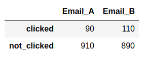

## Statistical Test 

### Scenario: Trying to decide between 2 slightly different versions of emails (A and B)

**Metric of choice: click-through-rate** 
Conducted an experiment whit a sample size of 1000. The 2 websites were shown and the click-through rate was measered.
The contingency table is shown below:

The data was analyzed using a Bayesian and a Frequentist approach. As it was the case, that only 2 variants were tested, I also used a proportion Z-test. 
